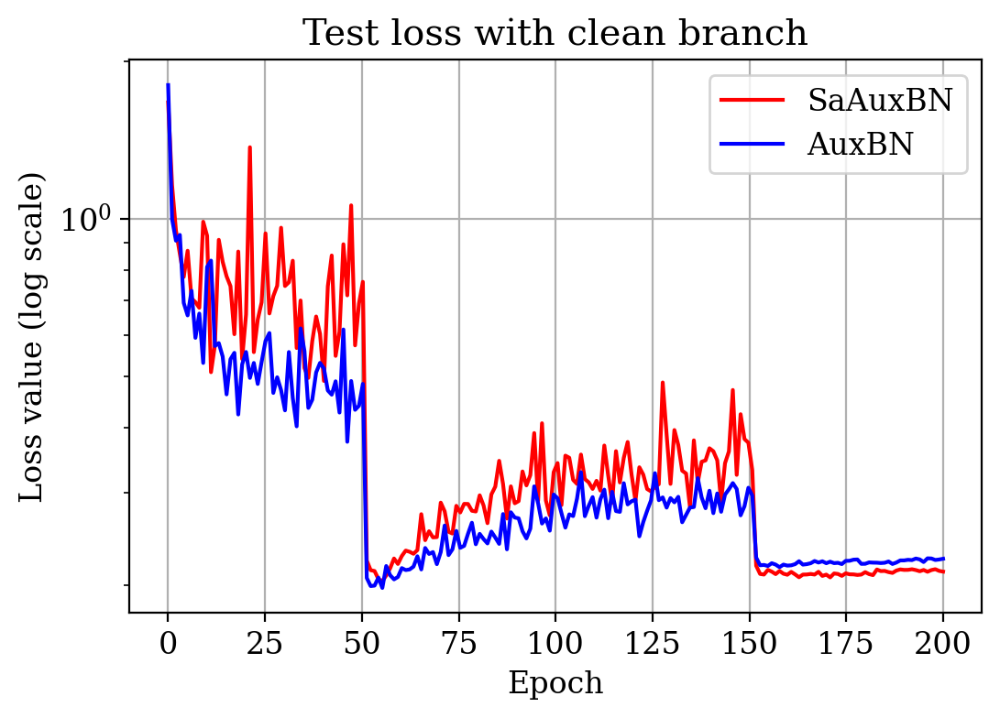
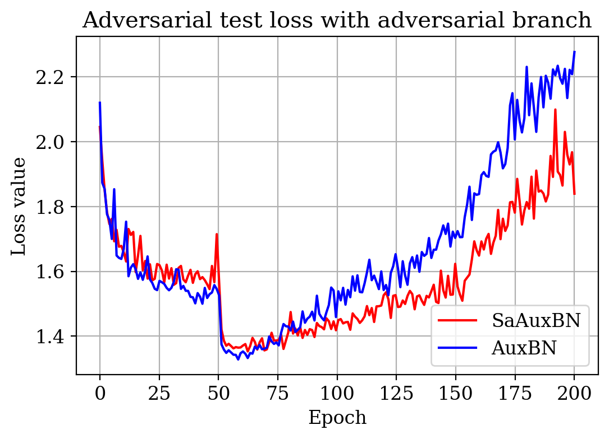

# Adversarial Training with SaBN

## Environment
* Ubuntu 16.04
* NVIDIA GPU
* python >= 3.6
## Quick start
### Installation:
1. Install pytorch >= v1.1.0 following [official instruction](https://pytorch.org/).
2. Clone this repo:
```bash
git clone https://github.com/VITA-Group/Sandwich-Batch-Normalization
cd Adv
```
3. Install dependencies:
```bash
pip install -r requirements.txt
```

### Usage
#### Training
```bash
bash scripts/train_autogan_ccbn_cifar10.sh
bash scripts/train_autogan_sabn_cifar10.sh

bash scripts/train_sngan_ccbn_cifar10.sh
bash scripts/train_sngan_sabn_cifar10.sh
```

#### Testing
Check Tensorboard:
```bash
tensorboard --logdir output --port 6001
```

### Results
The evaluation results: 

| Evaluation |   BN  | AuxBN (clean branch) | SaAuxBN (clean branch) (ours) |
|:----------:|:-----:|:--------------------:|:----------------------:|
| Clean (SA) | 84.84 |         94.47        |          **94.62**         |

|  Evaluation |   BN  | AuxBN (adv branch) | SaAuxBN (adv branch) (ours) |
|:-----------:|:-----:|:------------------:|:--------------------:|
|  Clean (SA) | **84.84** |        83.42       |         84.08        |
| PGD-10 (RA) | 41.57 |        43.05       |         **44.93**        |
| PGD-20 (RA) | 40.02 |        41.60       |         **43.14**        |

The visualization of test loss:

Test loss          |  Adversarial test loss
:-------------------------:|:-------------------------:
  |  