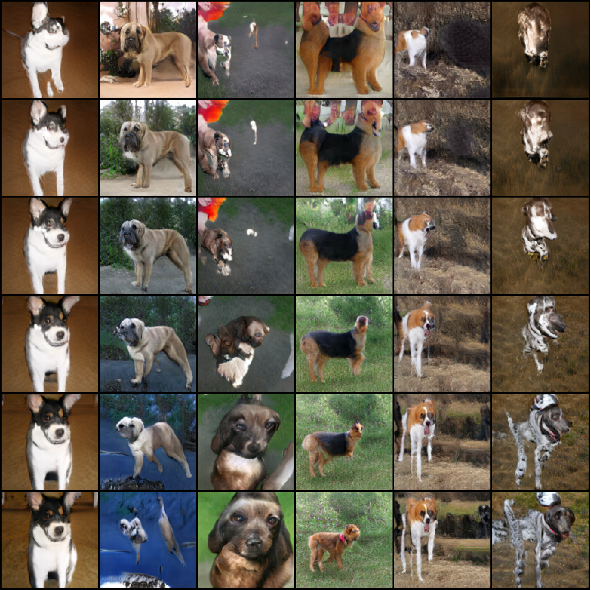
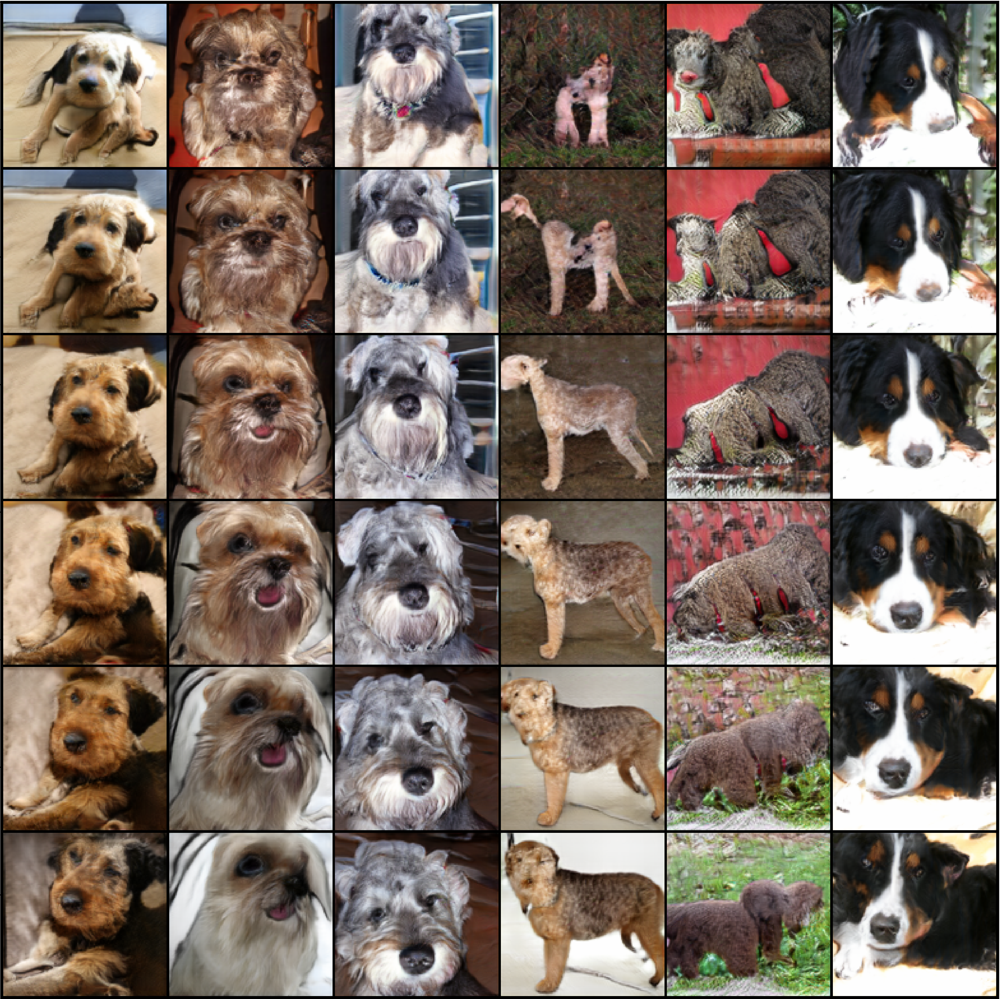

# Conditional Image Generation with SaBN
## Environment
* Ubuntu 16.04
* NVIDIA GPU
* python >= 3.6
## Quick start
### Installation:
1. Install pytorch >= v1.1.0 following [official instruction](https://pytorch.org/).
2. Clone this repo:
```shell
git clone https://github.com/VITA-Group/Sandwich-Batch-Normalization
cd GAN
```
3. Install dependencies:
```shell
pip install -r requirements.txt
```
4. Prepare dataset:
    1. Please download ILSVRC2012 dataset from [here](http://image-net.org/download-images).
    2. Follow the guideline [here](https://github.com/pfnet-research/sngan_projection#preprocess-dataset) to preprocess the ImageNet dataset.

5. Download pretrained models from our model zoo ([GoogleDrive](-)) and put it to `zoo`.
```shell
mkdir zoo
```

### Usage
#### Training
Experiments on CIFAR-10:
```shell
bash scripts/train_autogan_ccbn_cifar10.sh
bash scripts/train_autogan_sabn_cifar10.sh

bash scripts/train_sngan_ccbn_cifar10.sh
bash scripts/train_sngan_sabn_cifar10.sh
```

Experiments on ImageNet (cats and dogs):
```shell
bash scripts/sngan_ccbn_imagenet.sh
bash scripts/sngan_sabn_imagenet.sh
```

#### Testing
##### Tensorboard
```shell
tensorboard --logdir output --port 6001
```

##### Testing using model zoo's model ([GoogleDrive](https://drive.google.com/file/d/1lpzVmrwqD_E-J5mH7qttihIzNnDaslWw/view?usp=sharing)) 
```shell
bash scripts/test_autogan_sabn_cifar10.sh
bash scripts/test_sngan_sabn_cifar10.sh
bash scripts/test_sngan_sabn_imagenet.sh
```

### Results
Evaluation results:

|       Model      | Inception Score ↑ |     FID ↓     |
|------------------|-----------------|--------------|
| AutoGAN          |       8.43      |        10.51 |
| BigGAN           |       8.91      |         8.57 |
| SNGAN            |       8.76      |        10.18 |
| **AutoGAN-SaBN** (ours) |   8.72 (+0.29)  |  9.11 (−1.40) |
| **BigGAN-SaBN** (ours) |   9.01 (+0.10)   | 8.03 (−0.54) |
| **SNGAN-SaBN** (ours) |   8.89 (+0.13)  |  8.97 (−1.21) |

Visual results on ImageNet (128*128 resolution):

SNGAN          |  SNGAN-SaBN (ours)
:-------------------------:|:-------------------------:
  |  

