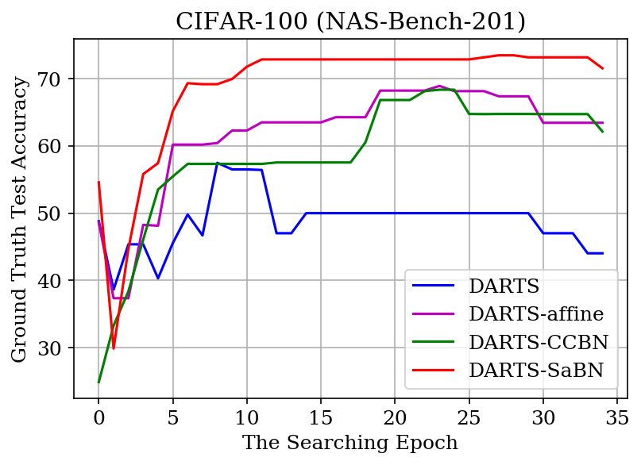
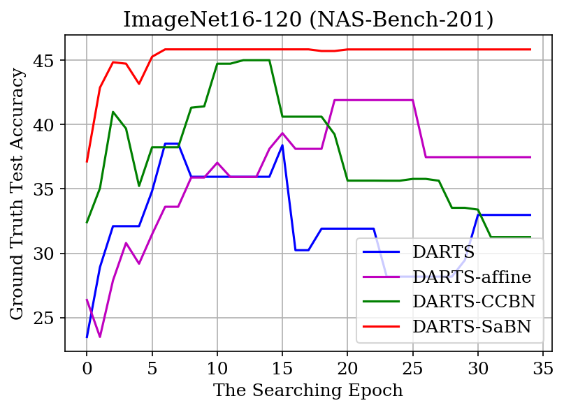

# Neural Architecture Search with SaBN

## Environment
* Ubuntu 16.04
* NVIDIA GPU
* python >= 3.6
## Quick start
### Installation:
1. Install pytorch >= v1.1.0 following [official instruction](https://pytorch.org/).
2. Clone this repo:
```bash
git clone https://github.com/VITA-Group/Sandwich-Batch-Normalization
cd NAS
```
3. Install dependencies:
```bash
pip install -r requirements.txt
```
4. Prepare dataset and bench file:
* Please follow the guideline [here](https://github.com/D-X-Y/AutoDL-Projects#requirements-and-preparation) to prepare the CIFAR-10/100 and ImageNet16-120 dataset, and also the NAS-Bench-201 database.
* **Remember to properly set the `TORCH_HOME`** via `export TORCH_HOME='path/to/data'`

### Usage
#### Training
```bash
bash scripts/DARTS-V1.sh cifar100 0 777 35
bash scripts/DARTS-V1-sabn.sh cifar100 0 777 35
```

#### Testing
Check Tensorboard:
```bash
tensorboard --logdir output --port 6001
```

### Results
Results on NAS-Bench-201 are presented below:

| Method            |     CIFAR-100    |     ImageNet     |
|-------------------|:----------------:|:----------------:|
| DARTS             |   44.05 ± 7.47   |   36.47 ± 7.06   |
| DARTS-SaBN (ours) | **71.56 ± 1.39** | **45.85 ± 0.72** |

CIFAR-100            |  ImageNet16-120
:-------------------------:|:-------------------------:
  |  
