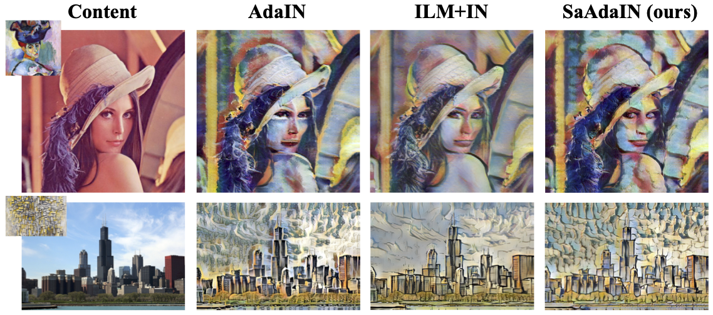
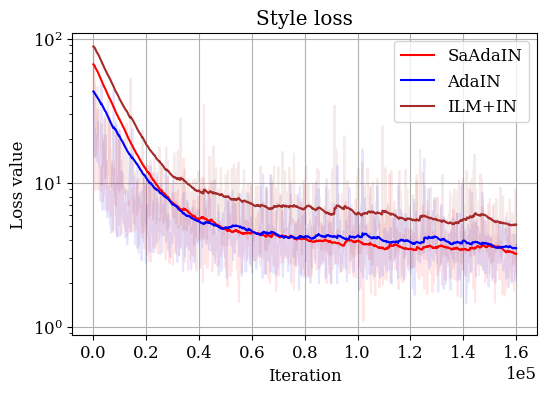
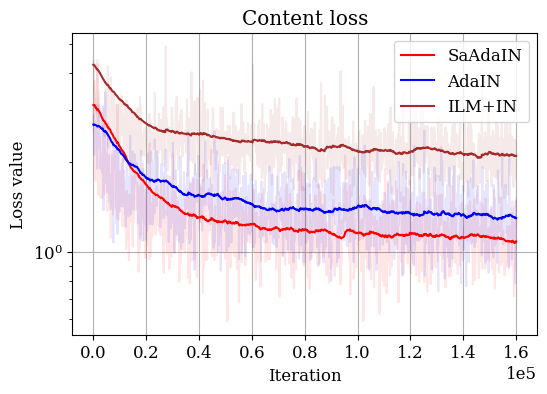
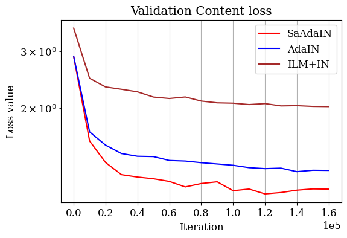

# Arbitrary Neural Style Transfer with SaAdaIN

## Environment
* Ubuntu 16.04
* NVIDIA GPU
* python >= 3.6
## Quick start
### Installation:
1. Install pytorch == v1.3.1 following [official instruction](https://pytorch.org/).
2. Clone this repo:
```shell
git clone https://github.com/VITA-Group/Sandwich-Batch-Normalization
cd NST
```
3. Install dependencies:
```shell
pip install -r requirements.txt
```
4. Prepare dataset:
    1. Please download coco dataset from [COCO download](http://cocodataset.org/#download).
    2. Download WikiArt dataset from [WikiArt download](https://www.kaggle.com/c/painter-by-numbers/data)

### Usage
#### Training
Run:
```shell
bash scripts/adain_net.sh
bash scripts/saadain_net.sh
```

#### Testing
Check Tensorboard:
```shell
tensorboard --logdir output --port 6001
```

## Results
The visual results:


The model equipped with the proposed SaAdaIN achieves lower style & content loss on both training and testing set.

**Training loss**:

Training style loss            |  Training content loss
:-------------------------:|:-------------------------:
  |  

**Validation loss**:

Validation style loss            | Validation content loss
:-------------------------:|:-------------------------:
  |  

## Acknowledgement
Code borrowed from [AdaIN](https://github.com/naoto0804/pytorch-AdaIN).

