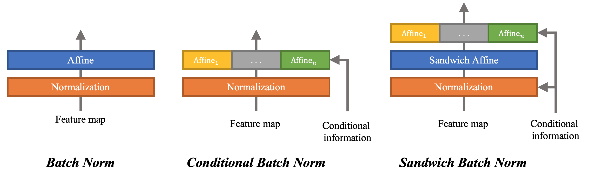
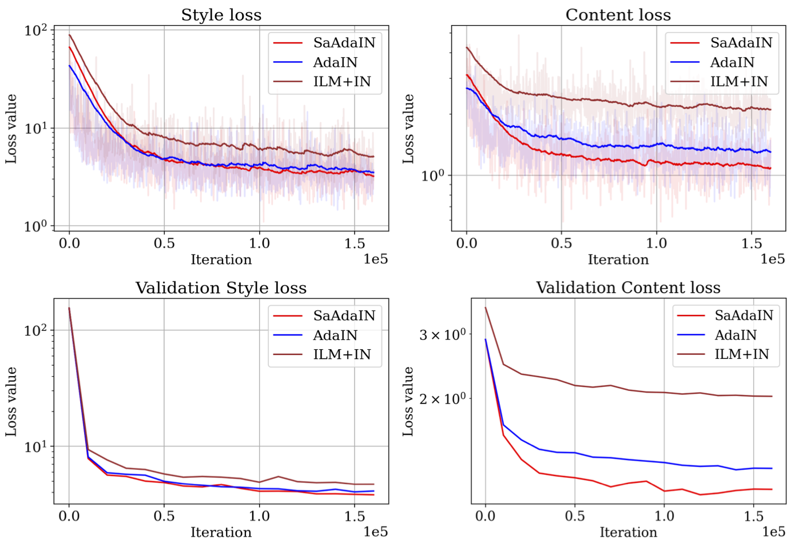

# Sandwich Batch Normalization

Code for [Sandwich Batch Normalization](-).

## Introduction
We present Sandwich Batch Normalization (SaBN), an extremely easy improvement of Batch Normalization (BN) with only a few lines of code changes.

We demonstrate the prevailing effectiveness of SaBN as a drop-in replacement in four tasks:
1. conditional image generation,
2. neural architecture search,
3. adversarial training,
4. arbitrary neural style transfer.

## Usage
Check each of them for more information:
1. [GAN](https://github.com/VITA-Group/Sandwich-Batch-Normalization/blob/main/GAN)
2. [NAS](https://github.com/VITA-Group/Sandwich-Batch-Normalization/blob/main/NAS)
3. [Adv](https://github.com/VITA-Group/Sandwich-Batch-Normalization/blob/main/Adv)
4. [NST](https://github.com/VITA-Group/Sandwich-Batch-Normalization/blob/main/NST)

## Main Results

### 1. Conditional Image Generation
Using SaBN in conditional generation task enables an immediate performance boost. Evaluation results on CIFAR-10 are shown below:

|       Model      | Inception Score ↑ |     FID ↓     |
|------------------|-----------------|--------------|
| AutoGAN          |       8.43      |        10.51 |
| BigGAN           |       8.91      |         8.57 |
| SNGAN            |       8.76      |        10.18 |
| **AutoGAN-SaBN** (ours) |   8.72 (+0.29)  |  9.11 (−1.40) |
| **BigGAN-SaBN** (ours) |   9.01 (+0.10)   | 8.03 (−0.54) |
| **SNGAN-SaBN** (ours) |   8.89 (+0.13)  |  8.97 (−1.21) |

### 2. Neural Architecture Search
We adopted DARTS as the baseline search algorithm. Results on NAS-Bench-201 are presented below:

| Method            | CIFAR-100 (top1) |  ImageNet(top1)  |
|-------------------|:----------------:|:----------------:|
| DARTS             |   44.05 ± 7.47   |   36.47 ± 7.06   |
| DARTS-SaBN (ours) | **71.56 ± 1.39** | **45.85 ± 0.72** |

CIFAR-100            |  ImageNet16-120
:-------------------------:|:-------------------------:
  |  

### 3. Adversarial Training
Evaluation results:

| Evaluation |   BN  | AuxBN (clean branch) | SaAuxBN (clean branch) (ours) |
|:----------:|:-----:|:--------------------:|:----------------------:|
| Clean (SA) | 84.84 |         94.47        |          **94.62**         |

|  Evaluation |   BN  | AuxBN (adv branch) | SaAuxBN (adv branch) (ours) |
|:-----------:|:-----:|:------------------:|:--------------------:|
|  Clean (SA) | **84.84** |        83.42       |         84.08        |
| PGD-10 (RA) | 41.57 |        43.05       |         **44.93**        |
| PGD-20 (RA) | 40.02 |        41.60       |         **43.14**        |

### 4. Arbitrary Neural Style Transfer

Model equipped with the proposed SaAdaIN achieves lower style & content loss:

 
## Acknowledgement
1. NAS codebase from [NAS-Bench-201](https://github.com/D-X-Y/AutoDL-Projects/blob/main/docs/NAS-Bench-201.md).
2. NST codebase from [AdaIN](https://github.com/naoto0804/pytorch-AdaIN).

